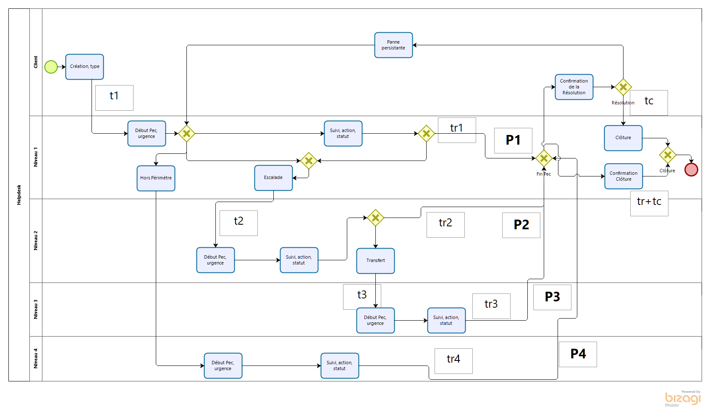
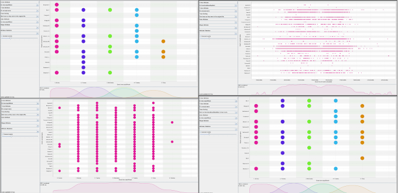
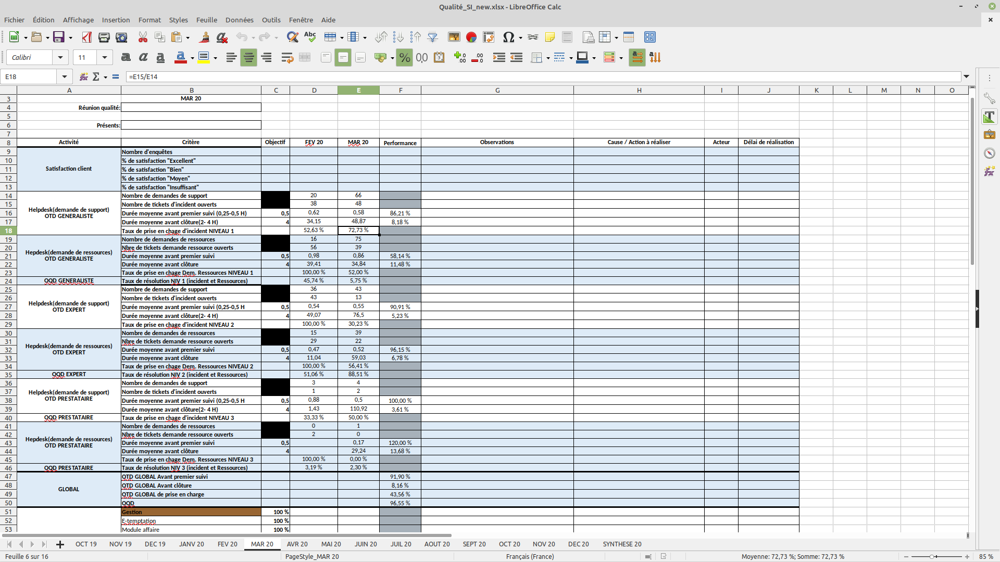
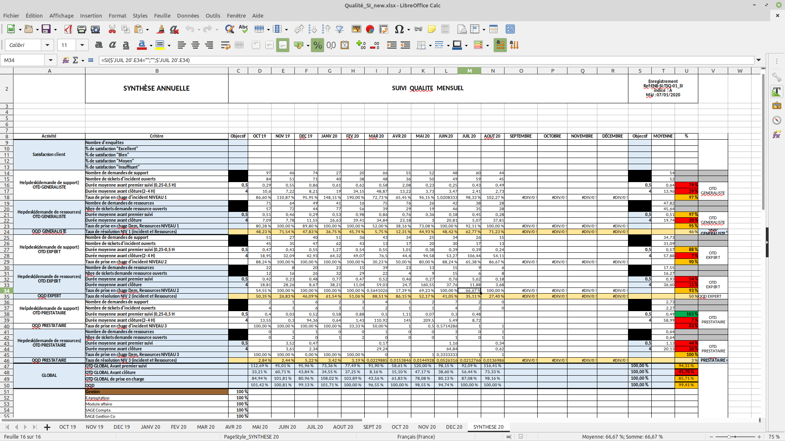

# Leto

## Business Intelligence

This project presents my work with PowerBI, Python, SQL, Bizagi, Numpy and Pandas. It was my very first project of 5000 LOC, therefore the code could be more factorized, but this project had been stopped because of Covid-19 and so it stayed at the prototype level.

I want to describe the operations I followed to produce some reports of Business Intelligence in an information system (IS).

First I have made a description as a BPMN of the entire IS with Bizagi.

Then I have made an Exploratory Data Analysis with some data mining tools such as Prom and Disco. 

After connecting my localhost to the ETL database of the IS, my main program, Leto, which was written in Python, computed a creation of many subdatabases which are plugable into PowerBI. Some examples of the reporting are in those links : [KPI_long.pdf](presentation/Indicateurs_performances_example.pdf), and [KPI_short.pdf](kpi_du_service_informatique.pdf).

As a developper, I was already concerned by memory profiling, so I investigated all the processes through the use of memory [memory_profiler](presentation/memory_performance.txt), and through the length of the computation [time_log](presentation/time_performance.txt).

My skills in Openpyxl for Excel, allowed me to work with the Quality Management System (QMS) of the IS, to deliver them an organic table of the performance, in numbers, during each month,  and also with an annual sum up 

The database was very light, and I couldn’t compute heavy machine learning algorithm on it. But I was delighted to do that program and I hope it would be a good proof of my skills in Business Intelligence and Data Science, in 2020.

